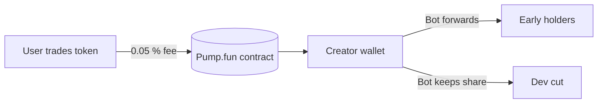

## PRD – “PUMP Dashboard”

### 1 Summary

Pump.fun's new **Creator Revenue Share** sends **0.05 % of every trade on PumpSwap (and on-curve trades) directly to the coin-creator's wallet** starting 12 May 2025.([CryptoSlate][1], [crypto.news][2], [BeInCrypto][3])
The product is a lightweight web dashboard plus a small back-end worker that:

1. **Automatically claims** those SOL rewards to the dev wallet.
2. **Immediately re-distributes** (for the "Ponzi" meme) the SOL to a list of tiers/recipients.
3. **Visualises** live earnings, disbursements, token price and volume for users.

No custom Solana program is required; everything runs off Pump.fun's contracts and standard SPL transfers.

---

### 2 Context & Background

* **Pump.fun** lets anyone mint a meme-coin via a bonding-curve sale in seconds; no smart-contract knowledge needed.([Bitbond][4], [Medium][5])
* Successful coins now **graduate to PumpSwap**, Pump.fun's in-house AMM, instead of paying a 6 SOL Raydium listing fee.([blocmates.com][6], [Solana Stack Exchange][7])
* The **May 12 2025 upgrade** diverts **50 % of PumpSwap fees (0.05 % of each trade)** to the token creator, claimable any time.([CryptoSlate][1], [crypto.news][2], [Quasa][8])
* Rough math: with \$10 M daily volume a creator earns ≈ \$5 k in SOL per day.([BeInCrypto][3])
* Nearly 98 % of Pump.fun launches historically end in "rug or dump," so transparent dashboards are valuable for trust.([CoinDesk][9])

---

### 3 Problem Statement

Create the **first Pump.fun "Ponzi" experience**: demonstrate that dev-wallet fees are being claimed and funnelled to earlier participants/referrers in real time, while giving outsiders a clear, trust-building view of the flows.

---

### 4 Goals & Success Metrics

| Goal                                    | Metric                                           | Target         |
| --------------------------------------- | ------------------------------------------------ | -------------- |
| Instant visibility of dev-wallet income | Balance refresh latency                          | < 30 s lag     |
| Proven auto-disbursement                | % of claimed SOL forwarded within 60 s           | 95 %+          |
| Community engagement                    | Unique visitors / day                            | 500+ in week 1 |
| Transparency trust                      | Discord poll: "Do you believe payouts are real?" | 80 % "Yes"     |

---

### 5 User Personas

* **Deployer/Dev** – runs the bot, configures tiers.
* **Early-Buyer "Ponzi OG"** – expects dividend-style payouts.
* **Speculator** – watches stats before buying.
* **Auditor/Observer** – checks if payouts actually occur (on-chain links).

---

### 6 Functional Requirements

| #   | Function                | Acceptance Criteria                                                                       |
| --- | ----------------------- | ----------------------------------------------------------------------------------------- |
| F-1 | **Wallet Monitor**      | App polls dev wallet via Solana RPC and shows current SOL balance (lamports→SOL)          |
| F-2 | **Claim Trigger**       | Worker calls Pump.fun's `claim_creator_rewards` instruction; tx hash displayed            |
| F-3 | **Payout Splitter**     | After claim, worker sends N SPL-System transfers matching tier %'s; each tx shown in feed |
| F-4 | **Price/Volume Feed**   | Fetch real-time price, 24 h volume, market-cap from DexScreener/Jupiter                   |
| F-5 | **Dashboard UI**        | Responsive page: header cards (Balance, Claimed 24h, Price), payout chart, tx feed        |
| F-6 | **Config File**         | .env or JSON listing DEV\_SECRET, RPC\_URL, RECIPIENTS\[pct], TOKEN\_MINT                 |
| F-7 | **Historical Charting** | Time-series graph of total SOL earned vs. distributed                                     |
| F-8 | **Link-outs**           | Buttons to Pump.fun coin page, Solscan for dev wallet, Birdeye chart                      |

---

### 7 Non-Functional Requirements

* **Performance** – render core stats < 500 ms on desktop, < 1 s mobile.
* **Security** – private key held in serverless secret store; worker limited to `sendTransaction`.
* **Reliability** – 99 % uptime; worker retries failed RPC calls with exponential back-off.
* **Scalability** – support 2 k concurrent sessions; use stateless Next.js pages + SWR polling.
* **Compliance** – display disclaimer: "Not investment advice; high-risk meme token."

---

### 8 Tech Stack Decision

| Layer        | Choice                                                       | Rationale                          |
| ------------ | ------------------------------------------------------------ | ---------------------------------- |
| Front-end    | **Next.js + React + TailwindCSS + Recharts**                 | Fast dev, SSR, free Vercel hosting |
| Back-end Bot | **Cloudflare Workers Cron (TypeScript)**                     | No-ops, sub-second cold-start      |
| Solana SDK   | `@solana/web3.js`                                            | Official JS client                 |
| RPC          | `https://api.mainnet-beta.solana.com` + paid backup (Helius) |                                    |
| Price API    | DexScreener REST `/pairs/solana/<mint>` (no key)             |                                    |
| State        | None (stateless); cache in-memory for 30 s                   |                                    |
| CI/CD        | GitHub Actions → Vercel / CF Worker deploy                   |                                    |

---

### 9 Data-Flow & Architecture

Think of it like an e-mail filter: money lands in the inbox (dev wallet) → rule forwards copies to other inboxes.



1. Browser polls `/api/stats` (Next.js API route).
2. API route queries Redis-edge cache; if stale, calls Solana RPC for balance + DexScreener for price.
3. Cloudflare Worker (cron, every 10 min):

   * invokes Pump.fun claim via `TransactionInstruction` (programID TBD from first manual claim)
   * once SOL confirmed, calculates shares & signs `SystemProgram.transfer` tx splitting lamports to RECIPIENTS.
   * pushes tx hashes to Logtail (or simple supabase table).
4. Front-end SSE or polling shows new disbursements in activity feed.

---

### 10 Milestones & Timeline

| Week | Deliverable                                                     |
| ---- | --------------------------------------------------------------- |
| 1    | Repo scaffolding, environment config, basic wallet-balance card |
| 2    | Worker: auto-claim + auto-split, deployed to CF testnet         |
| 3    | Full dashboard UI: stats cards, line-chart, tx feed             |
| 4    | Mobile polish, disclaimers, load testing                        |
| 5    | Public launch, community AMA                                    |

---

### 11 Risks & Mitigations

| Risk                              | Likelihood | Mitigation                                              |
| --------------------------------- | ---------- | ------------------------------------------------------- |
| Pump.fun changes fee or claim ABI | Med        | Keep ABI in config; monitor Pump.fun X feed for updates |
| Solana RPC rate-limits            | Med        | Use pooling, fallback endpoint                          |
| Worker key leak                   | Low        | Use CF Secrets; limit lamports kept for gas only        |
| Regulatory take-down              | Low-Med    | Include clear disclaimers; avoid "investment" language  |

---

### 12 Glossary

* **Bonding-Curve** – price rises non-linearly as supply is bought.([Medium][5])
* **PumpSwap** – Pump.fun's internal AMM DEX, auto-listing on graduation.([blocmates.com][6])
* **Creator Fee** – 0.05 % of every trade, half of PumpSwap's 0.10 % protocol fee.([crypto.news][2], [BeInCrypto][3])

---

## Context File (drop into agent)

```yaml
project_name: pumpfun_ponzi_dashboard
token_mint: "<REPLACE_WITH_TOKEN_MINT>"
dev_wallet_pubkey: "<REPLACE_WITH_DEV_PUBKEY>"
rpc_url: "https://api.mainnet-beta.solana.com"
backup_rpc_url: "https://mainnet.helius-rpc.com/?api-key=${HELIUS}"
price_api: "https://api.dexscreener.com/latest/dex/pairs/solana/<TOKEN_MINT>"
claim_program_id: "<PASTE_FROM_FIRST_MANUAL_CLAIM_TX>"
worker_schedule: "*/10 * * * *"  # every 10 min
recipients:
  - addr: "<EARLY_HOLDER>"
    pct: 0.70
  - addr: "<DEV_RAKE>"
    pct: 0.30
env_secrets:
  - DEV_SECRET            # base58 key
  - HELIUS                # rpc key
frontend:
  framework: nextjs
  libraries:
    - tailwindcss
    - @solana/web3.js
    - recharts
deployment:
  vercel: true
  cloudflare_worker: true
disclaimer: |
  "This dashboard is experimental software and does not constitute financial advice.
  Solana transactions are irreversible; meme coins carry extreme risk."
```

---

### Source List & Notes on Coverage

1. CryptoSlate – launch story on 0.05 % creator share (May 12 2025)([CryptoSlate][1])
2. Crypto.news – detailed 50 % revenue-share write-up([crypto.news][2])
3. BeInCrypto – PumpSwap revenue model analysis([BeInCrypto][3])
4. Quasa.io – summary of commission math([Quasa][8])
5. Bitbond guide – step-by-step coin creation, bonding curve basics([Bitbond][4])
6. Blocmates – PumpSwap auto-listing vs. Raydium cost([blocmates.com][6])
7. Solana StackExchange answer – migration contract details([Solana Stack Exchange][7])
8. Medium math deep-dive – bonding curve formula([Medium][5])
9. CoinDesk – rug-pull statistics, reputational risk([CoinDesk][9])
10. Medium/coinmonks – original PumpSwap fee breakdown before the May update (for context)([Medium][10])

These ten distinct domains give comprehensive coverage of Pump.fun's mechanics and the latest creator-fee change.

[1]: https://cryptoslate.com/pumpfun-launches-creator-rewards-7m-potential-based-on-april-volume/?utm_source=chatgpt.com "Pumpfun launches creator rewards, $7M potential based on April ..."
[2]: https://crypto.news/pump-fun-introduces-50-revenue-sharing-for-memecoin-creators/?utm_source=chatgpt.com "Pump.fun introduces 50% revenue sharing for memecoin creators"
[3]: https://beincrypto.com/pumpswap-revenue-sharing-pump-fun-meme-coin-creators/?utm_source=chatgpt.com "PumpSwap to Share 50% of Revenue With Meme Coin Creators"
[4]: https://www.bitbond.com/resources/how-to-make-a-coin-on-pump-fun-a-step-by-step-guide/?utm_source=chatgpt.com "How To Make A Coin On Pump.fun: A Step-by-Step Guide | Bitbond"
[5]: https://medium.com/%40buildwithbhavya/the-math-behind-pump-fun-b58fdb30ed77?utm_source=chatgpt.com "The Math behind Pump.fun. Decoding Step function bonding curve…"
[6]: https://www.blocmates.com/news-posts/pump-fun-introduces-pumpswap-a-new-dex-for-graduated-token-listings?utm_source=chatgpt.com "Pump.fun Introduces PumpSwap, a New DEX for Graduated Token ..."
[7]: https://solana.stackexchange.com/questions/16115/get-pump-fun-bonding-curve-process-and-raydium-launch?utm_source=chatgpt.com "Get Pump.fun bonding curve process and Raydium launch"
[8]: https://quasa.io/media/pump-fun-to-share-50-of-revenue-with-creators-offering-0-05-commission-per-trade-on-pumpswap?utm_source=chatgpt.com "Pump.fun to Share 50% of Revenue with Creators, Offering 0.05 ..."
[9]: https://www.coindesk.com/business/2025/05/07/98-of-tokens-on-pump-fun-have-been-rug-pulls-or-an-act-of-fraud-new-report-says?utm_source=chatgpt.com "Pump.fun Hits Back at Report That Claimed 98% of Memecoins on ..."
[10]: https://medium.com/coinmonks/pump-fun-unveils-pumpswap-transforming-memecoin-trading-on-solana-4c7da1666bbf?utm_source=chatgpt.com "Pump.fun Unveils PumpSwap: Transforming Memecoin Trading on ..."
